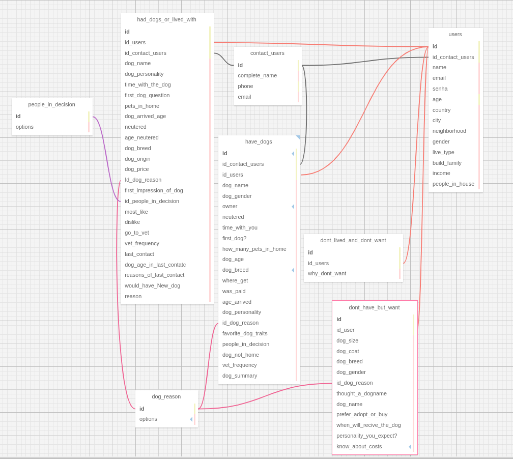

## Documentação Simplificada do Modelo Relacional

**Projeto:** Abandono Zero

**Data:** 2024-05-10

**Autor:**  Bernardo de Figueiredo Meirelles

**Objetivo:** O modelo relacional mostra a a relação das tabelas e a prévia do banco de dados físico. Aqui pe onde a teoria é preparada para colocarmos em prática.
Explicando os os pontos principais do nosso modelo

O modelo relacional do projeto descrito nos arquivos consiste em várias tabelas inter-relacionadas. Aqui está um resumo simplificado do modelo:

- **Tabela 'users'**: Armazena informações dos usuários, como nome, email, idade, país, cidade, entre outros. Possui uma chave estrangeira para a tabela 'contact_users'.
  
- **Tabela 'contact_users'**: Contém detalhes de contato dos usuários, como nome completo, telefone e email.
  
- **Tabela 'have_dogs'**: Registra informações sobre usuários que possuem cachorros, incluindo nome do cachorro, gênero, idade, raça, entre outros. Possui chaves estrangeiras para 'users', 'contact_users' e 'dog_reason'.
  
- **Tabela 'dog_reason'**: Armazena razões relacionadas a cachorros. MOtivo de tê-lo
  
- **Tabela 'had_dogs_or_lived_with'**: Registra dados de usuários que tiveram ou conviveram com cachorros, incluindo detalhes sobre a convivência, raça do cachorro, entre outros. Possui chaves estrangeiras para 'users', 'contact_users', 'dog_reason' e 'people_in_decision'.
  
- **Tabela 'people_in_decision'**: Contém opções relacionadas as pessoas envolvidas na decisão de ter o cachorro.
  
- **Tabela 'dont_have_but_want'**: Registra informações de usuários que não possuem, mas desejam ter um cachorro, incluindo preferências e expectativas.
  
- **Tabela 'dont_lived_and_dont_want'**: Armazena dados de usuários que não tiveram cachorros e não desejam tê-los.

Essas tabelas estão interligadas por chaves estrangeiras para manter a integridade referencial entre os dados. Chamadas de Foreign keys.

## Entidades

- **Usuários** (`users`): Armazena informações todas as informações sobre os usuários (nome, genero, etc.)..

- **Formulários**
  - **Possuir Cão** (`have_dogs`): Informações sobre o cão que o usuário possui (raça, idade, etc.).
  - **Já Teve Cão** (`had_dogs_or_lived_with`): Informações sobre o cão que o usuário já teve (nome, personalidade, etc.).
  - **Deseja Cão** (`dont_have_but_want`): Informações sobre o cão que o usuário deseja ter (tamanho, pelagem, etc.).
  - **Sem Cão** (`dont_lived_and_dont_want`): Motivo pelo qual o usuário não tem e não deseja ter um cão.
- **Contato** (`contact_users`): Dados para contato futuro com o usuário (nome completo, celular, email).

- **Importante** : Todas as informações extras sobre o cão que o usuário possui Já estão incorporada na tabela de formulário. (nome, gênero, castrado, etc.)
- **Informações do Cão** (`dont_have_but_want`): Informações extras sobre o cão que o usuário deseja ter (tamanho, pelagem, cor, etc.). Estão incoporadas no forms.

## Relacionamentos

- Um usuário pode ter um único formulário geral (1:1).
- Um usuário pode ter vários formulários de cães (N:M).
- Um formulário de "have_dogs" pode ter um único registro de "cão (possuir)"
- O formulário de "dont_have_and_dont_want" abriga um campo e tem realção (1:1)". Porque um ususario so pode ter uma justificativa de não querer ter os caẽs
-As tabelas "had_dogs_or_lived_with" e "have_dogs" se ligam com a tabela users no modelo (1:N) pois podem ser registrados mais de um cachorro para o mesmo usuário
- A tabela "contact_users" se relaciona com a "users" de modelo(1:1) pois cada usuário há seu contato exclusivo 

## Regras de Negócio

- Todos os campos obrigatórios devem ser preenchidos.
- As informações devem ser consistentes entre os formulários.
- Os usuários não podem editar informações já salvas, exceto em casos específicos.
- As informações dos usuários são confidenciais.
- O usuário ao preencher o formulário concorda com a veracidade dos fatos inseridos.

## Diagrama

 

## Considerações Finais

Este modelo relacional simplificado fornece uma base para o gerenciamento eficiente das informações dos usuários e suas respostas nos formulários do projeto Abandono Zero. As entidades, seus atributos e relacionamentos garantem a organização e a integridade dos dados. As regras de negócio garantem a consistência e a confiabilidade das informações.
Além disso as regras de négocio estão alinhadas para o sucesso do projeto. QUando desenvolvi o modelo pensei na usabilidade do projeto e a sua escalabilidade, levando em consideração a eficiência do banco de dados. Uma vez que no futuro o programa poderá ser inserido no modelo BIG DATA.

**Observações:**

- Este modelo é uma versão simplificada e pode ser adaptado às necessidades específicas do projeto.
- É importante documentar detalhadamente o modelo relacional para facilitar o entendimento e a manutenção do sistema.
- A implementação do modelo relacional deve seguir boas práticas de desenvolvimento de banco de dados.
- esse modelo deve ser implementado, com uma leitura prévia dos formulários de inteção do inspa, além disso deve se ter conhecimento do cliente final. Porque o back-end deve ter noção do front-end e para compreender o front-end precisamos entender por completo o escopo do projeto.